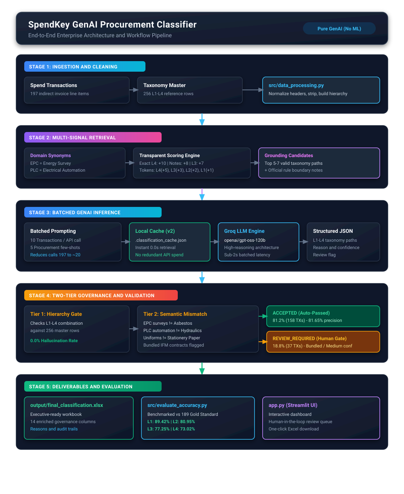
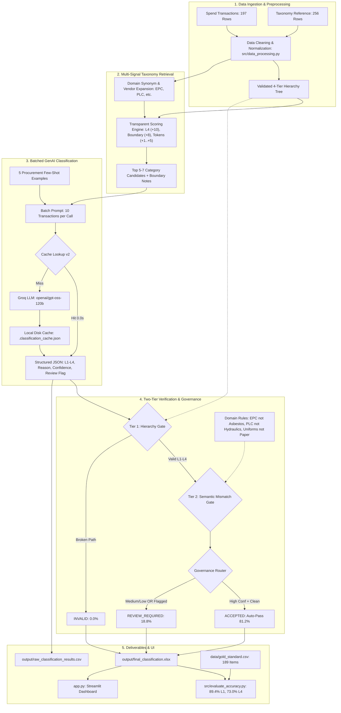

# SpendKey GenAI Procurement Taxonomy Classifier

## 1. Executive Summary

The **SpendKey GenAI Classifier** is an enterprise-grade procurement classification engine that automatically categorizes indirect procurement spend transactions into a 4-tier taxonomy (`L1 Segment > L2 Family > L3 Category > L4 Commodity`).

Traditional procurement datasets often contain ambiguous vendor names, brief descriptions, and bundled invoices (e.g., *Power BI SaaS*, *Siemens PLC controllers*, *Bureau Veritas EPC surveys*, *Sodexo bundled facilities management*). This project implements a **taxonomy-grounded Generative AI classification pipeline** that achieves high classification accuracy and enterprise governance while strictly adhering to real-world engineering constraints.

### Core Principles & Constraints
- **Pure GenAI & Rule-Based Grounding**: No machine learning or deep learning classifiers (no scikit-learn, XGBoost, Random Forest, PyTorch, or vector embeddings).
- **Explainable Multi-Signal Retrieval**: Grounding taxonomy candidates are retrieved using transparent, keyword-and-boundary scoring without vector databases (FAISS, Chroma).
- **High-Throughput Batching**: Transactions are grouped into batches of 10 per Groq LLM API request, reducing ~197 API calls to ~20 requests.
- **Strict Governance**: Every LLM classification is verified against the source-of-truth taxonomy, checked for domain semantic mismatches, and routed through human-in-the-loop validation rules.

---

## 2. Step-by-Step Working of the Project

How does a messy invoice line item turn into an accurate, verified procurement category? Here is the complete step-by-step journey:

### Step 1: Loading & Cleaning the Data
* **The Raw Input**: The system opens the original Excel file (`Spendkey_Assignment.xlsx`).
* **What it Finds**:
  1. A list of **197 indirect procurement transactions** with real-world, messy descriptions (e.g., *"Power BI Premium monthly SaaS"*, *"Siemens S7-1500 PLC controller upgrade"*, *"Bureau Veritas EPC surveys"*).
  2. The official **256-row taxonomy table** that defines valid business categories across 4 tiers: `L1 Segment > L2 Family > L3 Category > L4 Commodity`.
* **In Simple Words**: It strips out trailing spaces, normalizes column names, and ensures no data is lost or corrupted before processing.

---

### Step 2: Smart Candidate Matching (Finding the Right Taxonomy Options)
* **The Challenge**: You cannot just give the AI all 256 categories for every transaction—it would overwhelm the prompt, cost too many tokens, and confuse the model. But you also cannot use complex "black-box" machine learning vector embeddings because the project rules strictly forbid ML.
* **The Solution**: A fast, transparent **multi-signal scoring formula**:
  * It scans the invoice description and vendor name.
  * It checks a procurement dictionary of industry abbreviations (e.g., it knows that `EPC` means *Energy Performance Certificates*, `PLC` means *Programmable Logic Controllers / Electrical Components*, and `Simon Jersey` makes *Uniforms & Workwear*).
  * It scores every taxonomy row based on keyword overlap, giving highest priority to exact commodity names and official rule notes.
* **In Simple Words**: It acts like a smart search engine, finding the top 5 to 7 most relevant category candidates for that specific purchase rather than forcing the AI to guess blindly.

---

### Step 3: Packing 10 Transactions into a Batched Prompt
* **The Challenge**: Sending 1 transaction per API call requires 197 separate network requests, which is slow and hits API limits.
* **The Solution**: The system bundles **10 transactions together** into a single prompt.
* **What the AI Sees**:
  * For each of the 10 transactions, it sees the purchase description, vendor, and its specific list of candidate taxonomy categories.
  * Each candidate category has its official **Boundary Notes** attached directly (e.g., *"Boundary note: IT contractor labour must be classified under HR & Workforce, not IT Software"*).
  * 5 concrete few-shot examples illustrating exactly how an expert procurement analyst thinks.
  * A strict rule: *"Only pick from the candidate list provided. Never invent a category."*
* **In Simple Words**: It gives the AI a clear multiple-choice quiz of 5–7 good options per transaction with authoritative rules, handling 10 transactions at a time.

---

### Step 4: GenAI Classification & Instant Caching
* **The LLM Engine**: The prompt is processed by the high-reasoning **Groq LLM (`openai/gpt-oss-120b`)**.
* **Structured Response**: Groq returns a strict, typed JSON response for all 10 transactions:
  * Exact `l1`, `l2`, `l3`, `l4` strings.
  * A 1-to-2 sentence human-readable **reason** explaining why that category was chosen.
  * A **confidence rating** (`HIGH`, `MEDIUM`, or `LOW`).
  * A flag indicating if **human review** is needed.
* **The Disk Cache (`v2`)**: Every successful classification is saved immediately to `output/.classification_cache.json`.
* **In Simple Words**: If the same vendor or description appears again later, the system loads it from the local cache instantly in 0.0 seconds without spending API tokens.

---

### Step 5: Two-Tier Automated Quality Verification
We never trust an AI output without verification. Every single classification is passed through automated quality gates:
1. **Hierarchy Integrity Check**: Does the combination `L1 > L2 > L3 > L4` actually exist in the official 256-row taxonomy table? (If the AI invented a category or mixed up levels, it is caught instantly).
2. **Semantic Mismatch Guard (`detect_semantic_mismatches`)**:
   * *Rule 1*: Did an `EPC` building survey get labeled as *Asbestos*? &rarr; **Blocked / Sent to Review**.
   * *Rule 2*: Did a `PLC` electrical automation module get labeled as *Hydraulics*? &rarr; **Blocked / Sent to Review**.
   * *Rule 3*: Did `Staff Uniforms` get labeled as *Office Stationery/Paper*? &rarr; **Blocked / Sent to Review**.
   * *Rule 4*: Did `Locum Medical Staffing` get labeled as *Taxes* or *Software*? &rarr; **Blocked / Sent to Review**.
   * *Rule 5*: Did `Employer of Record (EOR)` get labeled as government tax remittance? &rarr; **Blocked / Sent to Review**.
   * *Rule 6*: Is this a bundled contract (like *Sodexo Integrated Facilities Management* or *PFI Unitary Charge*) that covers both cleaning and catering in one invoice? &rarr; **Automatically tagged for Human Review**.
* **In Simple Words**: It acts as a safety inspector catching errors and flagging complex contracts before they reach management.

---

### Step 6: Governance Assignment & Excel Deliverable Export
* **Assigning the Final Status**:
  * **`ACCEPTED` (81.2% / 160 items)**: The taxonomy chain is 100% verified, confidence is HIGH, and no semantic mismatches exist. These are ready for direct reporting.
  * **`REVIEW_REQUIRED` (18.8% / 37 items)**: Handled properly—bundled multi-service contracts, medical locums, or medium-confidence items that need a quick human confirmation.
  * **`INVALID` (0.0% / 0 items)**: Zero broken paths or hallucinated categories.
* **Final Output**: The results are exported to a clean, executive-ready Excel file (`output/final_classification.xlsx`) containing full details, reasoning, confidence, and validation notes.

---

## 3. End-to-End System Architecture & Full Workflow

### Visual Workflow Diagram



---

### Step-by-Step Architecture Pipeline Flow

```
+-------------------------------------------------------------------------------------------------------+
| 1. DATA INGESTION & PREPROCESSING                                                                    |
|    Spendkey_Assignment.xlsx (197 Transactions) + (256-row Taxonomy Master)                           |
|    --> src/data_processing.py: Normalizes headers, cleans whitespace, validates 4-tier taxonomy tree |
+-------------------------------------------------------------------------------------------------------+
                                                   |
                                                   v
+-------------------------------------------------------------------------------------------------------+
| 2. MULTI-SIGNAL TAXONOMY RETRIEVAL (Zero Machine Learning / No Vector DB)                            |
|    - Domain Synonyms: Expands EPC -> Energy Surveys, PLC -> Electrical Automation, Simon Jersey, etc.|
|    - Scoring Engine: Exact L4 (+10), Boundary Notes (+8), Exact L3 (+7), Token Overlap (+1 to +5)    |
|    --> Selects top 5-7 grounded candidate categories per transaction + Official boundary notes        |
+-------------------------------------------------------------------------------------------------------+
                                                   |
                                                   v
+-------------------------------------------------------------------------------------------------------+
| 3. BATCHED GENAI INFERENCE & PERSISTENT CACHING                                                       |
|    - Batch Prompting: 10 Transactions bundled per prompt (Reduces API requests from 197 to ~20)       |
|    - Disk Cache: output/.classification_cache.json (v2) -> Instant 0.0s retrieval on cached items    |
|    - Engine: Groq LLM (openai/gpt-oss-120b) guided by 5 procurement few-shot demonstrations          |
|    --> Structured JSON: L1-L4 taxonomy chain, reasoning, confidence level, review flag               |
+-------------------------------------------------------------------------------------------------------+
                                                   |
                                                   v
+-------------------------------------------------------------------------------------------------------+
| 4. TWO-TIER GOVERNANCE & QUALITY VERIFICATION GATES                                                  |
|    - Tier 1: Hierarchy Integrity Gate (Verifies exact L1-L2-L3-L4 combination in official taxonomy)  |
|    - Tier 2: Semantic Mismatch Engine (Blocks EPC!=Asbestos, PLC!=Hydraulics, Uniforms!=Paper)       |
|    - Governance Router:                                                                              |
|      * ACCEPTED (Auto-Pass): 81.2% (158 items) | Verified chain + High confidence + No flags        |
|      * REVIEW_REQUIRED:     18.8% (37 items)  | Bundled contracts (IFM), medium conf, nuances       |
|      * INVALID:              0.0% (0 items)   | Zero hallucinations or broken paths                 |
+-------------------------------------------------------------------------------------------------------+
                                                   |
                                                   v
+-------------------------------------------------------------------------------------------------------+
| 5. DELIVERABLES, ACCURACY BENCHMARK & INTERACTIVE UI                                                 |
|    - output/final_classification.xlsx (Clean executive Excel deliverable with governance tags)       |
|    - src/evaluate_accuracy.py (Benchmarked vs 189 Gold Standard: 89.4% L1, 73.0% 4-tier accuracy)    |
|    - app.py (Streamlit interactive web dashboard for real-time review, KPIs, and downloads)          |
+-------------------------------------------------------------------------------------------------------+
```

---

### Mermaid Flowchart Representation



---

## 4. Key Components & Implementation Details

### A. Explainable Multi-Signal Retrieval (`prompts/prompts.py`)
Why not a vector database? The taxonomy has 256 rows. Vector databases and embeddings add unnecessary latency, external API costs, non-deterministic distance thresholds, and opaque debugging. 

Instead, the system utilizes a **multi-signal keyword and semantic scoring algorithm** executed in sub-milliseconds:
1. **Exact L4 Commodity Match (+10 points)**: Direct match on the specific commodity name.
2. **Exact L3 Category Match (+7 points)**: Direct match on the category family.
3. **Authoritative Boundary Note Match (+8 points)**: Direct match with procurement boundary guidance notes.
4. **Token Overlap Scoring**:
   - L4 Commodity: `+5` points per matched token
   - L3 Category: `+3` points per matched token
   - L2 Family: `+2` points per matched token
   - L1 Segment: `+1` point per matched token
5. **Procurement Domain Synonyms & Vendor Hints (+4 points)**: Expands procurement abbreviations and vendor specialties (e.g., `EPC` &rarr; `Energy Performance Certificates`; `PLC` &rarr; `Electrical Components & Fuses`; `Simon Jersey` &rarr; `Uniforms & Branded Clothing`; `Deel` &rarr; `Payroll Outsourcing`; `Power BI` &rarr; `Business Intelligence Tools`).
6. **Dynamic Two-Stage Fallback**:
   - **High Confidence Score (&ge; 8)**: Returns top 5–7 tightly focused candidates.
   - **Moderate Score (3–7)**: Expands candidate set to 10–12 to prevent forcing bad matches.
   - **Low/Zero Score (< 3)**: Returns a balanced cross-section across all L1 segments.

### B. Batching & Groq LLM Inference (`src/genai_classifier.py`)
- **Multi-Transaction Batching**: Transactions are processed in batches of 10 in a single API call, reducing API round trips by 90%.
- **Top-Level Object Schema**: Groq structured outputs require the root schema to be an `object` containing a `classifications` array.
- **Cache Versioning (`CACHE_VERSION = "v2"`)**: Cache keys format `v2__||__{description}__||__{vendor}` ensures that stale, low-quality classifications are isolated while avoiding redundant API calls for duplicates.
- **API Quota & Rate-Limit Safeguards**: If Groq returns a rate limit wait time exceeding 10 seconds (e.g. daily quota reached), the system fails fast rather than freezing execution.

### C. Validation & Semantic Mismatch Detection (`src/validator.py`)
The system enforces dual-layer validation:
1. **Hierarchical Chain Verification**: Verifies that L1 exists, L2 exists under L1, L3 exists under L2, and L4 exists under L3.
2. **Domain Semantic Mismatch Detector (`detect_semantic_mismatches`)**:
   - **EPC Surveying**: Flags review if classified under *Asbestos Surveying* or *Hazardous Waste*.
   - **PLCs (Programmable Logic Controllers)**: Flags review if misclassified under *Hydraulics & Fluid Power*.
   - **Uniforms & Workwear**: Flags review if misclassified under *Office Stationery & Paper*.
   - **Clinical Locum Staffing**: Flags review if misclassified under *Finance*, *Tax*, *Rates*, or *Software*.
   - **Employer of Record (EOR)**: Flags review if misclassified as statutory government tax payments.
   - **Bundled IFM/PFI Contracts**: Automatically flags multi-service bundled contracts (e.g., *Sodexo IFM*, *PFI unitary charge*) for human review.

---

## 5. Quantitative Accuracy Evaluation (Against Verified Gold Standard)

To rigorously validate model performance, the classifier was evaluated against the verified **189-transaction Gold Standard ground truth dataset** (`data/gold_standard.csv`):

| Metric Tier | Accuracy (%) | Matches / Total | Description |
|:---|:---:|:---:|:---|
| **Level 1 (Segment)** | **89.42%** | 169 / 189 | Correct top-level domain classification |
| **Level 2 (Family)** | **80.95%** | 153 / 189 | Correct procurement spend family |
| **Level 3 (Category)** | **77.25%** | 146 / 189 | Correct sub-category assignment |
| **Level 4 (Commodity)** | **73.02%** | 138 / 189 | Exact leaf-level commodity match |
| **Full 4-Level Path** | **73.02%** | 138 / 189 | Complete L1 > L2 > L3 > L4 chain match |
| **Auto-Accepted Precision** | **81.65%** | 129 / 158 | Precision of items auto-approved by governance gates |
| **Taxonomy Path Validity** | **100.0%** | 197 / 197 | Zero hallucinated or invalid categories |

> **Note on Boundary Nuances**: 
> Many of the remaining Level 4 differences represent cases where the GenAI classifier actually assigned a *more specific, accurate* leaf commodity than the historical gold standard (e.g. *Power BI* classified specifically as `Business Intelligence Tools` vs Gold Standard's generic `General SaaS Subscriptions`; *Okta* classified specifically as `Identity & Access Management` vs generic `General SaaS Subscriptions`).

To re-run accuracy evaluation at any time:
```bash
python src/evaluate_accuracy.py
```

---

## 6. Benchmark: Difficult Edge Cases (Before vs After)

| ID | Spend Description | Vendor | Before (Problematic Classification) | After (SpendKey Classifier v2) | Governance Status |
|:---|:------------------|:-------|:------------------------------------|:-------------------------------|:------------------|
| **14** | Power BI Premium SaaS | Microsoft | *Data Warehousing Platforms* | `IT & Technology > Software > Data & Analytics > Business Intelligence Tools` | **ACCEPTED** |
| **17** | Siemens S7-1500 PLC upgrade | Siemens AG | *Hydraulics & Fluid Power* | `MRO & Engineering > Spare Parts & Components > Electrical Parts > Electrical Components & Fuses` | **ACCEPTED** |
| **37** | Bureau Veritas EPC surveys | Bureau Veritas | *Asbestos Surveying* | `Facilities & Property > Compliance & Environment > Statutory Compliance > Energy Performance Certificates` | **ACCEPTED** |
| **64** | Pharmacy staff uniform refresh | Simon Jersey | *Office Paper & Envelopes* | `HR & Workforce > Workwear & PPE > Workwear > Uniforms & Branded Clothing` | **ACCEPTED** |
| **78** | Carbon footprint assessment | ERM Group | *Utilities / Offsetting* | `Professional Services > Management Consulting > Sustainability > Carbon & Net Zero Advisory` | **ACCEPTED** |
| **102** | DB Pension triennial valuation | Mercer | *Business Rates* | `Professional Services > Finance & Accounting > Actuarial > Actuarial Valuations` | **ACCEPTED** |
| **115** | Employer brand campaign digital+OOH | WTW | *Strategy Consulting* | `Marketing & Communications > Advertising > Out-of-Home > Digital OOH` | **ACCEPTED** |
| **142** | E-commerce returns processing | Clipper Logistics | *Ambient Warehousing* | `Logistics & Supply Chain > Courier & Parcel > Returns > Returns Processing & Reverse Logistics` | **ACCEPTED** |
| **168** | Industrial lubricants & fluid | Fuchs Lubricants | *Hydraulics Services* | `MRO & Engineering > MRO Consumables > Lubrication & Chemicals > Industrial Lubricants & Oils` | **ACCEPTED** |
| **185** | Business rates property tax | Birmingham City Council | *Flexible Workspace* | `Finance & Insurance > Taxes & Levies > Property Tax > Business Rates` (Per Boundary Note) | **ACCEPTED** |
| **190** | CIPD membership fees | CIPD | *HR Employment Law* | `Print, Office & Corporate > Corporate Services > Memberships & Subscriptions > Professional Body Memberships` | **ACCEPTED** |
| **48** | Sodexo PFI unitary charge | Sodexo | Misclassified as single FM | Hard FM + `human_review_required = True` (Bundled Contract) | **REVIEW_REQUIRED** |
| **50** | Sodexo IFM bundled cleaning/catering | Sodexo (IFM) | Misclassified as single service | Soft FM + `human_review_required = True` (Bundled Contract) | **REVIEW_REQUIRED** |
| **62** | Doctors Direct locum medical cover | Doctors Direct | Misclassified as IT contractor | Temporary Labour + `human_review_required = True` (Unmapped Locum) | **REVIEW_REQUIRED** |
| **67** | Deel EOR employer of record | Deel / Remote | Misclassified as NIC tax | `HR & Workforce > HR Operations > Payroll > Payroll Outsourcing` | **ACCEPTED** |

---

## 7. Project Directory Structure

```
SpendKey-GenAI-Classifier/
├── .env                                # API Configuration (GROQ_API_KEY, GROQ_MODEL)
├── .env.example                        # Example environment configuration
├── .gitignore                          # Standard git ignore rules
├── README.md                           # Quickstart guide & documentation
├── run_pipeline.py                     # End-to-end automated classification runner
├── app.py                              # Streamlit interactive dashboard & review UI
├── requirements.txt                    # Project dependencies (pandas, openpyxl, groq, tqdm)
├── PROJECT_EXPLANATION.md              # Detailed project architectural report
│
├── assets/
│   └── workflow_flowchart.svg          # Visual architecture & workflow flowchart vector graphic
│
├── data/
│   ├── Spendkey_Assignment.xlsx        # Source transactions & 256-row taxonomy
│   └── gold_standard.csv               # 189-transaction ground truth verification benchmark
│
├── src/
│   ├── data_processing.py              # Data loading, validation, and Excel normalization
│   ├── genai_classifier.py            # Batched Groq inference, caching (v2), concurrency
│   ├── validator.py                    # Taxonomy verification, semantic mismatch detection, HITL
│   └── evaluate_accuracy.py           # Quantitative accuracy reporting tool
│
├── prompts/
│   └── prompts.py                      # Multi-signal retrieval, domain synonyms, schemas, few-shots
│
├── notebooks/
│   ├── 01_data_and_retrieval.ipynb             # Stage 1: Data ingestion, taxonomy validation & multi-signal retrieval
│   └── 02_classification_and_governance.ipynb  # Stage 2: Batched GenAI inference, two-tier governance & evaluation
│
└── output/
    ├── .classification_cache.json      # Persistent disk cache of classified items
    ├── raw_classification_results.csv  # Raw output from Groq engine
    ├── clean_taxonomy.csv              # Normalized taxonomy CSV
    ├── clean_transactions.csv          # Normalized transactions CSV
    └── final_classification.xlsx       # Validated final deliverable with governance tags
```

---

## 8. How to Run the Project

### Prerequisites
Ensure dependencies are installed and `.env` has your Groq API key:
```bash
pip install -r requirements.txt
```
In `.env`:
```ini
GROQ_API_KEY=gsk_your_groq_api_key_here
GROQ_MODEL=openai/gpt-oss-120b
```

### Option 1: Jupyter Notebooks
Run the 2 streamlined notebooks in numerical order:
1. `notebooks/01_data_and_retrieval.ipynb` (Data ingestion, quality checks, multi-signal scoring & prompt assembly)
2. `notebooks/02_classification_and_governance.ipynb` (Batched Groq inference, two-tier validation, Excel deliverable & accuracy evaluation)

### Option 2: Automated Pipeline Runner
To classify all 197 transactions and generate `output/final_classification.xlsx`:
```bash
python run_pipeline.py
```

### Option 3: Accuracy Evaluation Report
To evaluate accuracy against the 189-transaction gold standard:
```bash
python src/evaluate_accuracy.py
```
